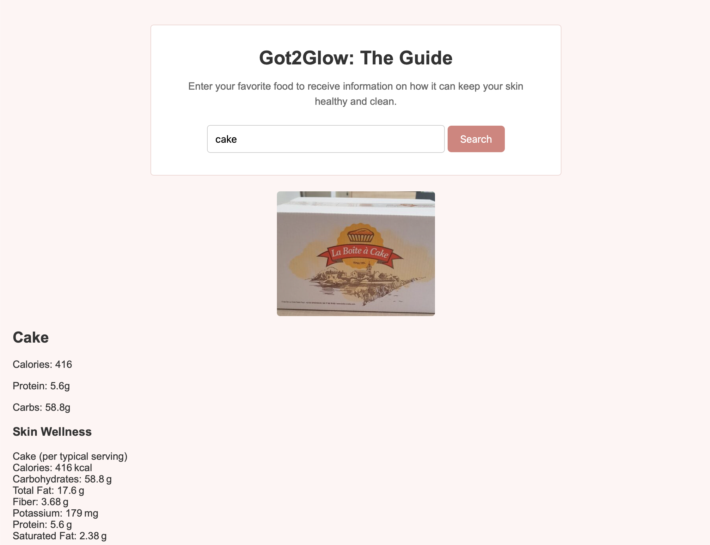

# Got2Glow Nutrition

A simple nutrition and skin wellness application built using HTML, CSS, and JavaScript.

## About

Got2Glow Nutrition allows users to search for a food and view its nutritional information along with insights related to general skin wellness.

The application uses the Dietly API to retrieve nutrition data based on the user’s search. Selected nutrition data is then passed to OpenRouter to generate a short skin wellness summary.

## Screenshot

## Built With

- HTML
- CSS
- JavaScript
- Dietly API
- OpenRouter API

## How It Works

1. The user searches for a food.
2. Dietly returns nutritional information for that food.
3. Relevant nutrition data is passed to OpenRouter.
4. OpenRouter generates a general skin wellness summary.
5. The food information and summary are displayed on the page.

## What I Practiced

- Fetching data from multiple APIs
- Using data from one API in a second API request
- Working with JSON data
- Using async / await
- Using user input in API requests
- DOM manipulation
- Displaying API results on the page
- Working with AI-generated API responses